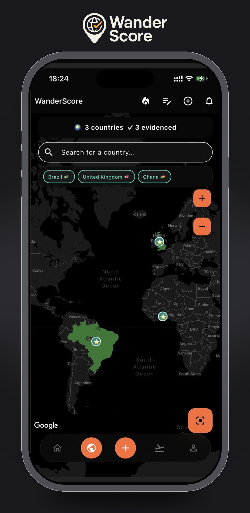
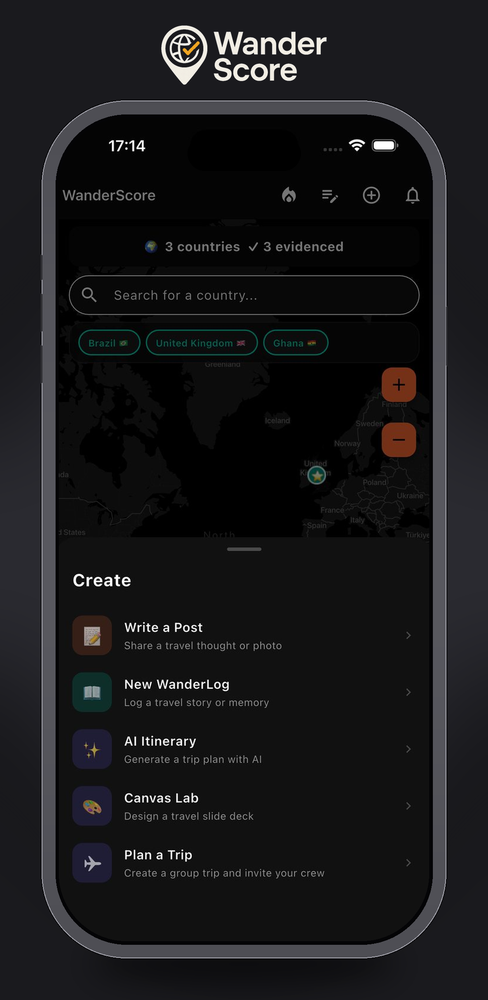
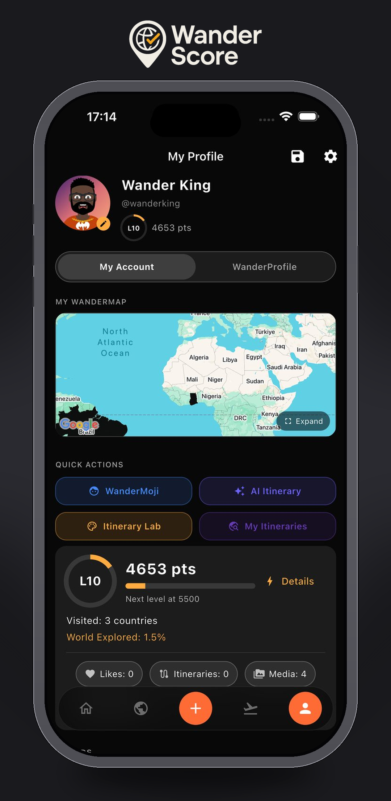
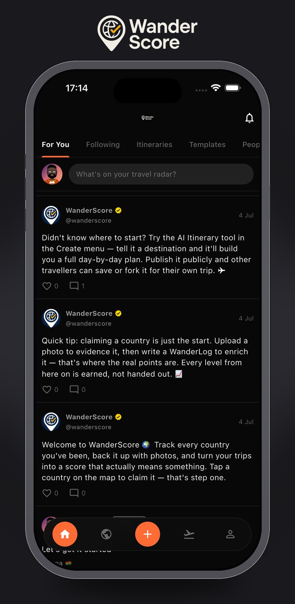

# WanderScore

**The all-in-one ecosystem for logging, planning, and creating the whole experience of travel.**

WanderScore isn't a travel tracker, a trip planner, or a travel blog platform — it's all three, connected into a single ecosystem where every trip becomes something you can log, share, plan around, and eventually monetise. Built solo, iOS-first, from the ground up with Flutter and Firebase.

📱 Currently in App Store review (first submission, July 2026) · Built and maintained solo by [TJ Adamu](https://github.com/BlackMangaTJ)

---

## Table of Contents

- [What is WanderScore?](#what-is-wanderscore)
- [The Three Pillars](#the-three-pillars)
- [Feature Tour](#feature-tour)
- [The Credibility System](#the-credibility-system)
- [Tech Stack](#tech-stack)
- [Architecture Highlights](#architecture-highlights)
- [Screenshots](#screenshots)
- [Business Model](#business-model)
- [Project Status](#project-status)

---

## What is WanderScore?

Most travel apps do one thing. TripAdvisor does discovery. TripIt does logistics. Polarsteps does logging. Instagram does social. Canva does creative design tools. None of them connect the whole loop — **experience → creativity → planning → community → income.**

WanderScore does. A user visits a country, writes about it, turns that experience into a shareable itinerary (either hand-built or AI-generated), plans their next trip with friends inside a shared group chat, and can publish or sell what they've created to other travellers. Every part of the app feeds every other part.

```
Visited a country (Map)
        ↓
Write about it (WanderLog)
        ↓
Build an itinerary from it (AI Generator or Itinerary Lab)
        ↓
Share it with your trip group (Trip Groups)
        ↓
Publish it publicly or sell it (Marketplace)
        ↓
Others discover it, plan their own trip (Explore Feed)
        ↓
They visit, log it, write about it... (cycle repeats)
```

A single **WanderScore** — a credibility and contribution score — runs through the entire loop, growing the more a user travels, documents, plans, shares, and helps others.

---

## The Three Pillars

### 🗺️ Log — What you've done
An interactive world map that fills in as you travel. Countries progress through three credibility tiers — **Claimed → Evidenced → Enriched** — each requiring more proof (a map tap, then photo/video evidence, then a written WanderLog) and unlocking more score. **WanderLog** is a genuine travel journal, not a photo dump — a place for real creative writing about real experiences, shareable privately, with friends, or with the world.

### ✈️ Plan — What you're going to do
An **AI itinerary generator** (powered by Claude) turns a destination, dates, and preferences into a structured, editable day-by-day plan. For users who want full creative control, the **Itinerary Lab** offers a Canva-style block editor (text, checklist, image, day-planner, tip blocks) plus a **Canvas Mode** for building shareable, Instagram-ready slide decks. **Trip Groups** bring friends into the same plan with an invite code, a shared live itinerary, group chat, and RSVP tracking.

### 💰 Share & Monetise — Turning experience into value
Published itineraries and templates are discoverable on a community Explore feed. Creators can sell templates through Apple IAP, or offer one free template to new followers to drive growth. A user's public profile — WanderLog entries, published itineraries, visited countries, WanderScore, and custom **WanderMoji** avatar — becomes a genuine travel portfolio.

---

## Feature Tour

| Feature | Description |
|---|---|
| **Interactive World Map** | Tap any country to claim it. Colour intensity reflects credibility tier — claimed countries are muted, evidenced/enriched countries are shown in full colour with a star marker. |
| **WanderLog** | Long-form travel journaling per country/city, with photo/video attachments and configurable privacy (private, friends, public). |
| **AI Itinerary Generator** | Claude-powered day-by-day itinerary creation from destination + trip length, fully editable after generation. |
| **Itinerary Lab (Block Mode)** | Manual itinerary builder with Text, List, Image, Day, and Tip blocks, plus ready-made templates (Weekend Escape, City Break, Adventure Trip). |
| **Canvas Lab** | A slide-deck editor for building visually designed, shareable itinerary decks — covers, photo grids, travel-detail cards, day slides — exportable as images. |
| **Trip Groups** | Create a trip, invite friends via an 8-character code, plan together in a shared live itinerary with group chat and Going/Maybe/No RSVP tracking. |
| **Social Feed** | A For You / Following / Itineraries / Templates / People feed for discovering other travellers' posts, published itineraries, and templates. |
| **Template Marketplace** | Publish itineraries or Canvas decks as templates — free (to grow followers) or paid via Apple IAP (four price tiers). |
| **WanderMoji** | A fully customisable cartoon avatar (skin, eyes, mouth, eyebrows, hair, clothes, accessories, facial hair, background) used across the app as your travel identity. |
| **WanderScore & Levels** | A points-based level system (L1 → L10+) reflecting real travel credibility and community contribution, shown on every profile. |

---

## The Credibility System

The map can't just be a self-reported checklist — anyone could tap every country in 60 seconds. WanderScore solves this with a two-track scoring model:

**Track 1 — Traveller Track** (physical proof of travel)

| Tier | Trigger | Points |
|---|---|---|
| Claimed | Tap a country on the map | 0 |
| Evidenced ✓ | Upload 1+ photo/video tagged to that country | 50 |
| Enriched ✓✓ | Evidenced + write a WanderLog entry for it | +25 |

**Track 2 — Creator Track** (knowledge and contribution, no travel required)

| Action | Points |
|---|---|
| Write a WanderLog entry | 15 |
| WanderLog read by another user | 5 |
| Create an AI itinerary | 10 |
| Itinerary liked/saved by another user | 20 |
| Publish a post | 10 |

Both tracks feed the same total score. This means a frequent traveller who never documents anything scores *lower* than someone who visits fewer places but writes rich, detailed WanderLogs — and a user who has never travelled can still build a high WanderScore purely by creating valuable content others use and trust. Tapping every country with no evidence yields **zero points** and a visibly faded map, which removes the incentive to game it.

---

## Tech Stack

**Framework:** Flutter / Dart

**Backend (Firebase):**
- Cloud Firestore — primary data store
- Firebase Auth — Google Sign-In and Sign in with Apple only (no email/password path)
- Firebase Storage — media uploads (evidence photos/videos, WanderLog attachments)
- Cloud Functions (Node.js) — server-verified operations
- Firebase Crashlytics & Performance Monitoring
- Firebase App Check — bot/abuse protection
- Firebase Analytics

**AI:** Anthropic Claude API, called via a Cloud Function for AI itinerary generation

**Monetisation:** `in_app_purchase` (Apple StoreKit) — four non-consumable template price tiers

**Maps:** `google_maps_flutter`

**State management:** Provider

---

## Architecture Highlights

- **Client-server trust boundary enforced server-side.** Sensitive writes — recording a template purchase, incrementing likes/comments on another user's content — go through Cloud Functions rather than direct client writes, closing a real vulnerability class where a signed-in client could otherwise fabricate its own purchase records or manipulate engagement counts.
- **Verified accounts are tamper-proof at the rules layer**, not just a client-side flag.
- **Tiered country data model** driving both map colour and score calculation from a single source of truth.
- **Cross-platform auth, single identity** — Google and Apple Sign-In both resolve to the same Firebase Auth identity, reducing attack surface and simplifying account recovery.
- **Non-consumable IAP model** — each template purchase is a one-time unlock, verified against Apple's servers via receipt validation before any record is written.

*A full technical writeup of the security audit and architecture decisions is available on request.*

---

## Screenshots

<p align="center">
  
  
  
  
</p>

---

## Business Model

WanderScore's revenue strategy layers four paths on top of a free core app:

1. **Premium subscription** (Pro / Elite tiers) — unlimited AI itineraries, unlimited trip groups, template publishing, verified creator badge
2. **Template marketplace** — creators sell itineraries/Canvas decks via Apple IAP; WanderScore takes a platform commission
3. **Affiliate commission** — hotels, flights, experiences, and travel insurance surfaced contextually in itinerary results (planned)
4. **Brand partnerships** — destination marketing boards, travel gear, airlines, and travel-rewards credit cards

The creator flywheel is the core growth loop: a great itinerary earns followers → followers buy templates → creators promote WanderScore to their own audience → more creators join → marketplace grows.

---

## Project Status

- ✅ Core map, tiered country tracking, and scoring system live
- ✅ WanderLog, social feed, and posts/comments/likes live
- ✅ AI itinerary generation (Claude API) live
- ✅ Itinerary Lab (block mode) and Canvas Lab live
- ✅ Trip Groups — invite codes, shared itinerary, group chat, RSVP — live
- ✅ WanderMoji avatar customisation live
- ✅ Template marketplace with Apple IAP (4 price tiers) — implemented
- ✅ First App Store submission complete — **in Apple review as of July 2026**
- 🔜 Public itinerary discovery / Explore feed expansion
- 🔜 Premium subscription tiers
- 🔜 Affiliate integrations

---

## About This Repository

This repository is a public overview of WanderScore for portfolio and partnership purposes. The active working codebase, including full development history, is maintained privately during this pre-launch period.

Interested in a technical deep-dive, a partnership, or a role? Reach out via [LinkedIn](https://linkedin.com/in/tijani-adamu-844144424) or through [wanderscore.app](https://wanderscore.app).

---

## License

Proprietary — © 2026 Black Manga Group Ltd. All rights reserved.
